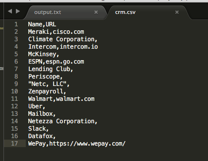
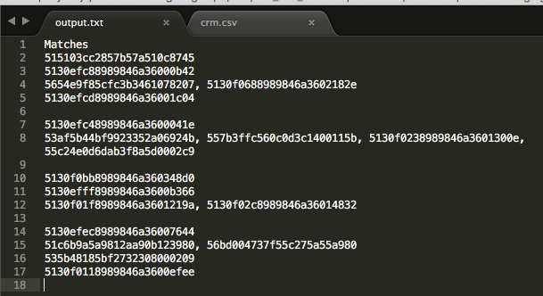

# Data Matching Engine

Takes your CSV file, parses it, and returns a list of same records that exist in database.

###Screenshots

Input:

Output:

Output:

###Getting Started

    npm install

###To Start Server

    npm start

Go to:

    http://localhost:8080/api/setupAccounts

Check that matching records are displayed. Go to:

    db/output.txt

###To Run Unit Tests

    npm run test

###Tech Stack

    Node.js
    ES6
    Babel
    Mongoose.js
    MongoDB
    Express
    Webpack
    fast-csv
    DotEnv